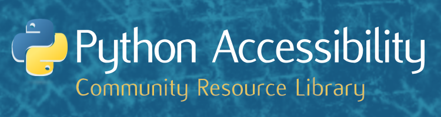
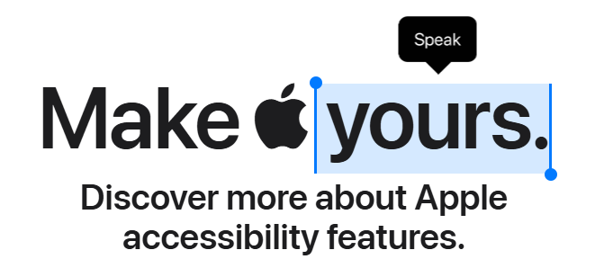

# Python Accessibility Resource Library

<!--img align='right' src="" alt="" width="30%" height="auto"/-->

This repository provides a comprehensive list of accessibility resources for the Python community.

## Table of Contents
I. [**Assistive Technologies and Tools**](#i-assistive-technologies-and-tools) 
  - [*Screen Readers and Physical Assistive Devices*](#screen-readers-and-physical-assistive-devices) 
  - [*Python-Specific Tools*](#python-specific-tools)
    
II. [**Development Resources**](#ii-development-resources) 
  - [*Testing and Compliance Tools*](#testing-and-compliance-tools) 
  - [*Standards and Guidelines*](#standards-and-guidelines)
    
III. [**Inclusive Design**](#iii-inclusive-design) 
  - [*Neurodiversity Accommodations*](#neurodiversity-accommodations) 
  - [*Translation and Localization*](#translation-and-localization) 
  - [*AI-Assisted Tools*](#ai-assisted-tools)
    
IV. [**Community Resources**](#iv-community-resources) 
  - [*Organizations*](#organizations) 
  - [*Education and Training*](#education-and-training) 
  - [*Events and Inclusion*](#events-and-inclusive-accommodations)

## I. Assistive Technologies and Tools

> Embracing assistive technology is essential for fostering inclusivity and ensuring digital accessibility. By prioritizing accessibility in product and service design, we can create seamless experiences that enable individuals with diverse needs to participate fully online, without barriers or hindrances.
> The impact of assistive technology is profound, enabling individuals with diverse abilities and needs to engage fully in various aspects of life, from education and employment to social connections and daily activities.

---

### 
Screen Readers and Physical Assistive Devices

---

- #### **[NVDA](https://github.com/nvaccess/nvda/) *(NonVisual Desktop Access)***
  A free, open-source screen reader published by NFP organisation [NV Access](https://www.nvaccess.org/) in early 2007.
  It's widely used in the accessibility community, due to it's free-nature, compatibility with many applications including web browsers, email clients, and office suites.
  NVDA had been translated into more than 55 different languages, and is used in more than 175 countries.

  
> [!IMPORTANT]
> * Not suitable for Non-Windows users.
> NVDA is only supported on Windows 8.1, Windows 10, Windows 11, and all Windows Servers from 2012 R2 onwards.

---

- #### **[JAWS](https://www.freedomscientific.com/products/software/jaws/) *(Job Access With Speech)***
  The world's most popular commercial screen reader, developed for computer users whose vision loss prevents them from seeing screen content or navigating with a mouse.
  JAWS provides speech and braille output for popular computer applications on Windows.

> [!IMPORTANT]
> * Requires Windows 11, Windows 10, or Windows Server 2019/2016
> * Includes drivers for popular Braille displays
> * Features OCR capabilities for inaccessible PDF documents
  
> [!NOTE]
> Unlike NVDA, JAWS is a paid product with several licensing options.:
> * **Home Annual License**: $95/year (US only, personal/non-commercial use)
> * Home License: $1,200 (perpetual, personal/non-commercial use)
> * Professional License: $1,625 (perpetual, personal or commercial use)

---
  

- #### **[VoiceOver](https://www.apple.com/accessibility/vision/) *(macOS Screen Reader)***
  A comprehensive screen reader built directly into macOS, iOS, iPadOS, watchOS, and tvOS.
  As a native Apple solution, VoiceOver provides seamless integration with all Apple applications and many third-party apps.
  
  VoiceOver includes features like:
  - Audio descriptions of screen elements
  - Support for over 35 languages
  - Braille display compatibility
  - Customizable keyboard commands

> [!NOTE]
> * Only available on Apple devices
> * No additional cost (included with operating system)
> * Regular updates through OS updates

---

- #### **[Mozilla DeepSpeech](https://github.com/mozilla/DeepSpeech) *(Speech-to-Text Engine)***
  An open-source speech-to-text engine based on Baidu's Deep Speech research paper.
  While not a screen reader itself, DeepSpeech can be integrated into Python applications to enable speech recognition capabilities.
  
  Key features include:
  - Pre-trained models for English speech recognition
  - Python, JavaScript, C, and .NET implementations
  - Ability to train custom models

> [!NOTE]
> * Requires technical knowledge to implement
> * Can be used to build custom accessibility solutions
> * Active development community

---

- #### **[Focus 80 Blue](https://www.freedomscientific.com/products/blindness/focus-blue-family/) *(Braille Display)***
  A refreshable braille display that offers tactile reading experience with 80 braille cells and Bluetooth connectivity.
  The Focus 80 Blue can be paired with screen readers like JAWS, NVDA, or VoiceOver to provide braille output.
  
  Features include:
  - 80 refreshable braille cells
  - Bluetooth connectivity for wireless use
  - Integrated braille keyboard
  - NAV Rockers and cursor router buttons

> [!NOTE]
> * Hardware solution (not software)
> * Compatible with multiple screen readers
> * Significant investment (typically $5,000+)

---

### 
Python-Specific Tools

---

- #### **[pyatspi](https://gitlab.gnome.org/GNOME/pyatspi2) *(Python ATK-SPI Bindings)***
  A Python wrapper for AT-SPI (Assistive Technology Service Provider Interface), providing accessibility features for GUI applications.
  These bindings allow Python applications to interact with assistive technologies like screen readers.
  
  Key features include:
  - Access to the accessibility interfaces of GTK+ and other toolkits
  - Ability to query and manipulate accessible objects
  - Event listening for accessibility-related changes

> [!NOTE]
> * Primarily for Linux/GNOME environments
> * Requires understanding of accessibility APIs
> * Used in tools like Accerciser

---

- #### **[Tka11y](https://pypi.org/project/Tka11y/) *(Tkinter Accessibility)***
  Makes Tkinter applications accessibility-aware by allowing screen readers and other assistive technologies to interact with Tkinter widgets.
  While not a standalone package, accessibility features are available through the Tkinter extension modules.
  
  Capabilities include:
  - Exposing widget roles and states to assistive technologies
  - Supporting keyboard navigation
  - Providing text alternatives for graphical elements

> [!NOTE]
> * Documentation is limited
> * Requires manual implementation of accessibility features
> * Works best with modern Tkinter versions

---

- #### **[wxPython](https://www.wxpython.org/) *(Cross-platform GUI toolkit)***
  A Python wrapper for the wxWidgets library that powers many accessible applications, including NVDA itself.
  wxPython provides native-looking interfaces on Windows, Mac, and Linux while maintaining accessibility support.
  
  Accessibility features include:
  - Built-in support for screen readers
  - High-contrast mode compatibility
  - Keyboard navigation support
  - Customizable font sizes

> [!NOTE]
> * Larger footprint than some other GUI toolkits
> * Excellent documentation and community support
> * Consistent cross-platform accessibility behavior

---

- #### **[Django All-in-One Accessibility](https://pypi.org/project/django-all-in-one-accessibility/) *(Django Accessibility Package)***
  A package that enhances Django website accessibility for people with various disabilities including hearing or vision impairments, motor impairments, and cognitive challenges.
  
  The key features include:
  - **Comprehensive Accessibility Standards Support**: Adherence to a wide range of international accessibility standards, including ADA, WCAG 2.1, Section 508, and others.
  - **Quick Installation**: Can be installed in as little as two minutes.
  - **Customizable Widget**: Dynamic widget color and position for a seamless user experience.
  - **Multi-Language Support**: Supports 40 languages to cater to a global audience.
  - **Risk Reduction**: Reduces the risk of time-consuming accessibility lawsuits.

> [!NOTE]
> * Requires Django web framework
> * Regular updates to maintain compatibility with WCAG guidelines
> * Simplifies compliance with accessibility standards

---

## II. Development Resources

---

### 
Testing and Compliance Tools

---

- #### **[Accerciser](https://gitlab.gnome.org/GNOME/accerciser) *(Accessibility Explorer)***
  An interactive Python accessibility explorer that uses AT-SPI to inspect, examine, and interact with widgets.
  Helps developers ensure their applications provide correct information to assistive technologies.
  
  Key features include:
  - Visual representation of the accessibility tree
  - Interface viewer for examining accessible properties
  - Event monitor for tracking accessibility events
  - Script recorder for automating accessibility tests

> [!NOTE]
> * Primarily for GNOME/Linux environments
> * Python-based and extensible
> * Essential tool for accessibility testing on Linux

---

- #### **[Pa11y](https://pa11y.org/) *(Accessibility Testing Tool)***
  A command-line tool for testing web accessibility in Python applications. Pa11y runs accessibility tests on your pages via the command line or Node.js, which can be integrated into Python workflows.
  
  Key features include:
  - Automated testing against WCAG 2.0 and 2.1 guidelines
  - CI/CD integration capabilities
  - Customizable test configurations
  - HTML, JSON, and CSV report formats

> [!NOTE]
> * Requires Node.js environment
> * Can be integrated with Python via subprocess or API
> * Supports testing against multiple WCAG levels

---

- #### **[WCAG Compliance Checker](https://github.com/squizlabs/HTML_CodeSniffer) *(HTML_CodeSniffer)***
  An open-source tool to ensure websites meet Web Content Accessibility Guidelines standards. It provides a JavaScript-based means to scan HTML source code and detect violations of a defined coding standard.
  
  Features include:
  - Support for WCAG 2.0 levels A, AA, and AAA
  - Section 508 standards compliance checking
  - Customizable ruleset for organization-specific requirements
  - Browser bookmarklet for quick testing

> [!NOTE]
> * Can be integrated with Python web frameworks
> * No installation required for basic browser testing
> * Detailed explanations of accessibility violations

---

- #### **[Accessibility Insights](https://accessibilityinsights.io/) *(Microsoft Accessibility Testing Tool)***
  A development tool from Microsoft that helps identify and fix accessibility issues in web applications, Windows applications, and Android applications.
  
  Key capabilities include:
  - FastPass for quick scanning of critical accessibility issues
  - Assessment mode for comprehensive WCAG 2.1 AA coverage
  - Tab stops visualization
  - Color contrast analyzer
  - Headings visualization

> [!NOTE]
> * Available as browser extension, Windows application, and Android application
> * Free and open-source
> * Regular updates from Microsoft's accessibility team

---

### 
Standards and Guidelines

---

- #### **[Web Content Accessibility Guidelines (WCAG)](https://www.w3.org/WAI/standards-guidelines/wcag/) *(W3C Standard)***
  The universal standard for digital accessibility developed by the World Wide Web Consortium (W3C). WCAG provides a single shared standard for web content accessibility that meets the needs of individuals, organizations, and governments internationally.
  
  WCAG is organized around four principles:
  - Perceivable: Information must be presentable to users in ways they can perceive
  - Operable: User interface components must be operable
  - Understandable: Information and operation must be understandable
  - Robust: Content must be robust enough to work with current and future technologies

> [!NOTE]
> * Current version is WCAG 2.1 (published June 2018)
> * Three conformance levels: A (minimum), AA (standard), AAA (enhanced)
> * Legal standard in many countries and jurisdictions

---

- #### **[ARIA Authoring Practices Guide (APG)](https://www.w3.org/WAI/ARIA/apg/) *(W3C Resource)***
  Guidelines for implementing accessible rich internet applications using WAI-ARIA (Web Accessibility Initiative - Accessible Rich Internet Applications) to create accessible web experiences.
  
  The guide includes:
  - Design patterns for common widgets (menus, tabs, dialogs)
  - Keyboard interaction specifications
  - ARIA role, state, and property usage examples
  - Working examples with source code

> [!NOTE]
> * Maintained by W3C's Accessibility Working Group
> * Complementary to WCAG guidelines
> * Essential resource for dynamic web application development

---

- #### **[Mobile Accessibility Guidelines](https://www.w3.org/WAI/standards-guidelines/mobile/) *(W3C Resource)***
  Resources for ensuring mobile applications are accessible, covering touch interfaces, screen size variability, and device-specific considerations.
  
  Key aspects include:
  - Guidelines for touch target size and spacing
  - Recommendations for handling device orientation changes
  - Input method alternatives beyond touch
  - Strategies for limited screen real estate

> [!NOTE]
> * Complements WCAG but addresses mobile-specific concerns
> * Relevant for Python-based mobile frameworks
> * Includes considerations for low bandwidth and high latency environments

---

## III. Inclusive Design

---

### 
Neurodiversity Accommodations

---

- #### **[Light/Dark Mode Implementation](https://developer.mozilla.org/en-US/docs/Web/CSS/@media/prefers-color-scheme) *(Accessibility Feature)***
  Resources for implementing toggleable light and dark modes in Python applications, which can help autistic individuals and others with light sensitivity.
  
  Implementation approaches include:
  - CSS media queries for web applications
  - System preference detection
  - User preference storage
  - Smooth transitions between modes

> [!NOTE]
> * Reduces eye strain and can prevent migraines
> * Essential for users with photosensitivity
> * Can improve readability in different lighting conditions

---

- #### **[OpenDyslexic Font Integration](https://opendyslexic.org/) *(Typography Resource)***
  Guidelines for incorporating the OpenDyslexic font into Python applications to help prevent confusion between similar letters for users with dyslexia.
  
  Features of OpenDyslexic:
  - Heavier bottom weighting to letters
  - Unique letter shapes to increase recognition
  - Increased letter spacing
  - Open source and free to use
  - Now uses the SIL-OFL License, allowing it's use in any product.

> [!NOTE]
> * Can be implemented in web applications via CSS
> * Desktop applications can use system fonts or bundled fonts
> * Should be offered as an option rather than default

---

- #### **[Color Contrast Tools](https://webaim.org/resources/contrastchecker/) *(Accessibility Testing Resource)***
  Tools for checking and implementing appropriate color contrast in Python applications, addressing potential barriers for users with sensory processing differences.
  
  Popular tools include:
  - WebAIM Contrast Checker
  - Colour Contrast Analyser
  - Accessible color palette generators
  - Python libraries for programmatic contrast checking

> [!NOTE]
> * WCAG 2.1 requires contrast ratio of at least 4.5:1 for normal text
> * Large text (18pt+) requires 3:1 contrast ratio
> * Essential for users with low vision or color blindness

---

- #### **[Meaningful Variable Naming Guidelines](https://peps.python.org/pep-0008/) *(PEP 8 : Python Style Guide)***
  Best practices for creating descriptive variable names instead of abstract ones like A, B, C, which can improve code readability for neurodivergent programmers.
  
  Key recommendations include:
  - Using descriptive names that reflect purpose
  - Avoiding abbreviations unless widely understood
  - Maintaining consistent naming conventions
  - Following Python's standard style guide (PEP 8)

> [!NOTE]
> * Benefits all developers, not just neurodivergent ones
> * Particularly helpful for those with working memory differences
> * Improves maintainability and collaboration

---

- #### **[Comment and Docstring Templates](https://peps.python.org/pep-0257/) *(PEP 257 : Docstring Conventions)***
  Standardized formats for writing clear comments and docstrings that explain code functionality, helping neurodivergent users better understand code structure.
  
  Best practices include:
  - Consistent formatting using triple quotes for docstrings
  - Including purpose, parameters, return values, and exceptions
  - Using plain language rather than jargon
  - Providing examples for complex functionality

> [!NOTE]
> * Follows PEP 257 standards for docstring conventions
> * Can be enforced with linters like pydocstyle
> * Particularly helpful for users with executive function differences

---

- #### **[Audio Control Implementation](https://www.w3.org/WAI/WCAG21/Understanding/audio-control.html) *(WCAG Guideline)***
  Code examples for implementing WCAG 2.2.1 guidelines on making audio controls adjustable, which helps prevent sensory overload for autistic users.
  
  Implementation features:
  - Volume controls that are easily discoverable
  - Mute functionality that persists between sessions
  - No auto-playing audio without user consent
  - Visual indicators of audio state

> [!NOTE]
> * Required for WCAG 2.1 Level A compliance
> * Essential for users with auditory processing sensitivities
> * Beneficial in shared or quiet environments

---

- #### **[Timing Adjustment Features](https://www.w3.org/WAI/WCAG21/Understanding/timing-adjustable.html) *(WCAG Guideline)***
  Resources for implementing flexible timing in Python applications, beneficial for users with ADHD who may need additional time to complete tasks.
  
  Key implementation aspects:
  - Options to extend time limits
  - Warnings before timing out
  - Ability to save progress
  - Session persistence

> [!NOTE]
> * Required for WCAG 2.1 Level A compliance
> * Helps users with cognitive disabilities, language barriers, and motor impairments
> * Should be implemented for any time-sensitive functionality

---

- #### **[Sensory-Friendly UI Guidelines](https://www.w3.org/WAI/WCAG21/Understanding/three-flashes-or-below-threshold.html) *(Design Resource)***
  Best practices for creating user interfaces that avoid overwhelming sensory elements like flashing animations or auto-playing audio.
  
  Guidelines include:
  - Limiting or eliminating flashing elements (less than 3 flashes per second)
  - Providing motion/animation controls
  - Using subtle transitions
  - Avoiding parallax effects and background video

> [!NOTE]
> * Prevents seizures and physical discomfort
> * Essential for users with vestibular disorders
> * Improves focus for users with attention differences

---

- #### **[Python-Based Benchmarking Tools](https://www.linkedin.com/pulse/measuring-neurodiversity-inclusion-python-based-benchmarking-andrew-f/) *(Example)***
  Code examples from the neurodiversity inclusion benchmarking system that helps organizations assess their accessibility efforts.
  
  Features include:
  - Automated testing scripts for common accessibility issues
  - Scoring systems for measuring progress
  - Comparative analysis against industry standards
  - Customizable criteria based on specific user needs

> [!NOTE]
> * Helps track accessibility improvements over time
> * Can be integrated into continuous integration pipelines
> * Provides objective metrics for accessibility compliance

---

### 
Translation and Localization

---

- #### **[deep-translator](https://github.com/nidhaloff/deep-translator) *(Free Multi-Translator Library)***
  A flexible, free, and unlimited Python tool supporting multiple translation providers including Google, Microsoft, PONS, Linguee, MyMemory, and Yandex.
  
  Key features include:
  - Translation directly from text files
  - Command-line interface for terminal usage
  - Automatic language detection
  - Support for batch translations
  - Multiple translation options for a single word

> [!NOTE]
> * Available under MIT license
> * No API key required for most translators
> * Actively maintained and regularly updated

---

- #### **[googletrans](https://py-googletrans.readthedocs.io/en/latest/) *(Google Translate Python Library)***
  A free Python library implementing Google Translate API. It provides a simple interface to Google's translation service.
  
  Features include:
  - Auto language detection
  - Bulk translations
  - Customizable service URL
  - HTTP/2 support
  - Connection pooling

> [!NOTE]
> * Not actively maintained
> * May require using a release candidate version to avoid issues
> * Maximum character limit of 15k per text
> * No API key required, but stability not guaranteed
> * Could end up with a Google IP ban

---

- #### **[translators](https://github.com/UlionTse/translators) *(Multiple Translator Library)***
  A comprehensive library supporting multiple translation providers including Google, Bing, Alibaba, and others.
  
  Key capabilities:
  - Support for multiple translation engines
  - Free usage for individuals and students
  - Simple API for translation tasks
  - Automatic language detection

> [!NOTE]
> * Designed for personal and educational use
> * May have usage limitations based on the underlying services
> * Provides fallback options if one service fails

---

- #### **[translate](https://github.com/terryyin/translate-python) *(Command-line Translation Tool)***
  A simple command-line tool and Python module supporting multiple engines including Google, Microsoft, and DeepL.
  
  Features include:
  - Command-line interface for quick translations
  - Python module for integration into applications
  - Support for multiple translation engines
  - Simple API design

> [!NOTE]
> * Available both as a Python module and a command-line utility
> * Lightweight implementation
> * Good for simple translation needs

---

- #### **[TextBlob](https://textblob.readthedocs.io) *(NLP Library with Translation)***
  A powerful text processing library that includes translation capabilities using Google Translate under the hood, along with numerous NLP features.
  
  Capabilities include:
  - Part-of-speech tagging
  - Noun phrase extraction
  - Sentiment analysis
  - Language detection and translation
  - Word inflection and lemmatization
  - Spelling correction

> [!NOTE]
> * Built on NLTK and Pattern
> * Simple, intuitive interface
> * Translation is just one of many features
> * Ideal for projects requiring both translation and text analysis

---

- #### **[MarianMT Models](https://huggingface.co/docs/transformers/en/model_doc/marian) *(Hugging Face Transformer Models)***
  Pre-trained translation models available through the Hugging Face Transformers library, based on the same architecture as BART.
  
  Key features:
  - Over 1,000 language pair models available
  - No internet connection required after downloading
  - Each model is approximately 298 MB
  - Transformer encoder-decoder architecture with 6 layers
  - Support for multilingual translation

> [!NOTE]
> * Requires more technical knowledge to implement
> * No API calls needed (works offline)
> * Models named as "Helsinki-NLP/opus-mt-{src}-{tgt}"
> * Higher quality translations than some API-based services

---

- #### **[Python i18n](https://github.com/danhper/python-i18n) *(Internationalization Library)***
  A library providing internationalization functionality for Python applications, based on Rails i18n library.
  
  Features include:
  - Support for YAML and JSON translation files
  - Placeholder functionality
  - Pluralization support
  - Fallback languages
  - Simple translation API

> [!NOTE]
> * Designed for application internationalization rather than general translation
> * Requires pre-defined translation files
> * Ideal for multilingual applications
> * Simple API with `t()` function for translations
> * Inactive since 2020

---

### 
AI-Assisted Tools

---

- #### **[Python-Based Benchmarking Tools](https://www.linkedin.com/pulse/measuring-neurodiversity-inclusion-python-based-benchmarking-andrew-f) *(Neurodiversity Assessment Tools)***
  Code examples and frameworks for assessing an organization's neurodiversity inclusion efforts, including functions that evaluate accommodations and generate performance reports.
  
  Key features include:
  - Functions to calculate neurodiversity inclusion percentages
  - Letter grade conversion for intuitive performance assessment
  - Customized report generation with conditional formatting
  - Identification of areas needing improvement

> [!NOTE]
> * Designed specifically for workplace neurodiversity assessment
> * Can be integrated into continuous improvement processes
> * Provides objective metrics for tracking inclusion progress

---

- #### **[Adaptive Learning Features](https://www.restack.io/p/python-ai-personalized-education-answer-cat-ai) *(AI-Enhanced Learning)***
  Resources for implementing AI tools that track progress and provide personalized recommendations based on user history and preferences.
  
  Implementation approaches include:
  - Dynamic learning pathways that adjust in real-time
  - Recommendation algorithms using collaborative filtering
  - Personalized content generation based on learning styles
  - Predictive analytics for identifying students needing support

> [!NOTE]
> * Can be implemented using Python libraries like Surprise
> * Particularly beneficial for neurodivergent learners
> * Requires careful design to avoid reinforcing biases

---

- #### **[Visual Confidence Indicators](https://www.restack.io/p/explainable-ai-answer-visualizing-ai-outputs-cat-ai) *(AI Transparency Tools)***
  Implementation guides for adding visual indicators that show AI confidence levels in outputs, helping neurodivergent users gauge information reliability.
  
  Visualization techniques include:
  - Color-coded confidence scales
  - Numerical confidence scores with thresholds
  - Interactive visualizations allowing parameter adjustment
  - Dimensionality reduction for complex data visualization

> [!NOTE]
> * Improves trust in AI-generated content
> * Essential for applications where reliability assessment is critical
> * Can be implemented using Python visualization libraries like Matplotlib
> * Research shows that low morphological clarity visualizations may sometimes increase user confidence

---

## IV. Community Resources

---

### 
Organizations

---
- #### **[Center for Accessibility and Open Source](https://www.getrecall.ai/summary/accessibility/open-source-and-accessibility-empowering-people-with-disabilities-globally) *(Advocacy Organization)***
  An organization working to bring accessibility into the open source world by building disability inclusion into communities that sustain open source projects.
  
  Key activities include:
  - Sustainably bringing accessibility into open source communities
  - Building disability inclusion into communities that sustain open source projects
  - Supporting education and improving accessibility of open-source tooling
  - Helping organizations like GitHub think about accessibility

> [!NOTE]
> * Aims to create better outcomes for people with disabilities
> * Works directly with open-source maintainers, participants, and contributors
> * Supports internships for students with disabilities to help break down barriers

---

- #### **[Global Accessibility Awareness Day (GAAD) Foundation](https://gaad.foundation/what-we-do) *(Nonprofit Organization)***
  A nonprofit organization founded by Joe Devon and Jennison Asuncion that promotes accessibility awareness and has established the GAAD pledge for open-source projects to make accessibility a core value.
  
  Programs include:
  - Global Accessibility Awareness Day (third Thursday of May)
  - GAAD Pledge for organizations to make accessibility a core value
  - Speakers Fund to support accessibility presentations at tech conferences
  - Gaadys event to honor those advancing digital accessibility

> [!NOTE]
> * Founded in 2021, ten years after the first Global Accessibility Awareness Day
> * Mission is "to disrupt the culture of technology and digital product development to include accessibility as a core requirement"
> * GAAD began in 2012 and has grown into a global movement

---

- #### **[/sophiakibaker/Accessible-Python Repository](https://github.com/sophiakibaker/Accessible-Python) *(GitHub Resource)***
  A collection of resources and materials created by Sophia Ki Baker to make Python programming more accessible to people with disabilities and/or neurodivergencies.
  
  Current resources include:
  - Guides for changing fonts, colors, and text size in Google Colab
  - Instructions for switching between dark and light mode
  - Setup guides for syntax and type checking
  - Autocomplete configuration in Google Colab notebooks

> [!NOTE]
> * Repository is actively maintained (last updated January 2024)
> * Includes general accessibility resources for events and content production
> * Author welcomes requests for materials in alternative formats

---

### 
Education and Training

---

- #### **[W3C WAI Digital Accessibility Foundations](https://www.w3.org/WAI/courses/)** *(Free Online Course)*
  A comprehensive self-paced course from the World Wide Web Consortium (W3C) Web Accessibility Initiative (WAI) designed for a wide range of learners.
  
  Course features:
  - Designed for both technical and non-technical learners
  - Covers principles from the Web Content Accessibility Guidelines (WCAG)
  - Takes approximately 16-20 hours to complete
  - Available free of charge on the edX platform through at least December 2024
  - Optional verified certificate available for $99

> [!NOTE]
> * Suitable for developers, designers, UX professionals, content authors, project managers, and people with disabilities
> * Covers topics including WCAG standards, POUR principles (Perceivable, Operable, Understandable, Robust)
> * Implements open curriculum developed by the W3C WAI Education and Outreach Working Group

---

- #### **[Accessibility Tutorials](https://www.w3.org/WAI/tutorials/)** *(W3C Resource)*
  A collection of practical guides showing how to develop web content that is accessible to people with disabilities while providing a better user experience for everyone.
  
  Tutorial topics include:
  - Page structure and navigation
  - Menu structure and implementation
  - Accessible images and tables
  - Form controls and validation
  - Carousels and dynamic content
  - Using HTML, CSS, WAI-ARIA, and other technologies

> [!NOTE]
> * Designed for web developers, designers, trainers, content authors, and project managers
> * Provides boilerplate solutions for common coding challenges
> * Based on common tasks in web projects
> * Concepts apply to multiple web technologies including HTML4, HTML5, CSS3, and WAI-ARIA

---

### 
Events and Inclusive Accommodations

---

- #### **[Technology Guidelines for Inclusive Events](https://eventupplanner.com/digital-accessibility-in-event-planning-common-pitfalls-best-practices/) *(Event Accessibility Resource)***
  Resources for ensuring digital content at Python community events is accessible, with comprehensive guidelines for before, during, and after events.
  
  Key features include:
  - Screen reader compatibility requirements for event websites
  - Keyboard navigation implementation for those unable to use a mouse
  - Live captioning services for presentations
  - Multiple formats for presentation materials
  - Clear digital signage and wayfinding in large print

> [!NOTE]
> * WCAG 2.1 Level AA compliance is recommended as the minimum standard
> * Virtual and hybrid events require additional technology-dependent accessibility considerations
> * Dedicated technical support team should be available for addressing accessibility issues

---

- #### **[Occupancy Counter Implementation](https://vilros.com/blogs/projects/raspberry-pi-occupancy-counter-project) *(Python Hardware Project)***
  Code examples for creating occupancy counters using Python and Raspberry Pi that allow neurodivergent users to time their visits to spaces based on how crowded they are.
  
  Implementation details:
  - Uses sensor pins to detect entry and exit
  - Tracks current occupancy count with increment/decrement logic
  - Updates GUI to display current count
  - Can be expanded to publish data to websites or apps

> [!NOTE]
> * Particularly helpful for individuals who experience sensory overload in crowded spaces
> * Can be implemented using affordable hardware (Raspberry Pi)
> * Alternative implementation using computer vision is also possible

---

- #### **[Transdiagnostic Support Framework for Neurodivergent Adults](https://iaap-journals.onlinelibrary.wiley.com/doi/full/10.1111/apps.12431)** *(Evidence-Based Approach)*
  A comprehensive systematic review examining physical workplace adjustments to support neurodivergent workers, with a focus on sensory needs and environmental modifications.
  
  Key findings include:
  - Most effective adjustments address auditory stimulation (private offices, noise-cancelling headphones) and light sensitivity (lighting control)
  - Environmental control and autonomy over workspace significantly impacts occupational longevity and performance
  - Workplace adjustments should be individualized rather than using one-size-fits-all approaches
  - Physical modifications should be implemented alongside psychosocial supports for maximum effectiveness

> [!NOTE]
> * Based on a systematic review of 20 studies published between 2000-2021
> * Primarily focuses on autism spectrum conditions, with limited evidence for ADHD and dyslexia
> * Highlights significant research gaps, particularly regarding hyposensitivity accommodations
> * Emphasizes the importance of person-environment fit theory in workplace accommodation design
